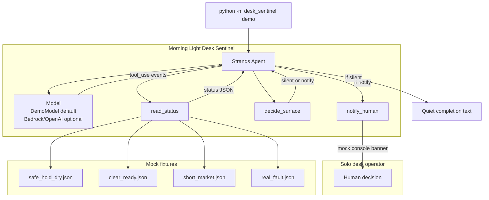
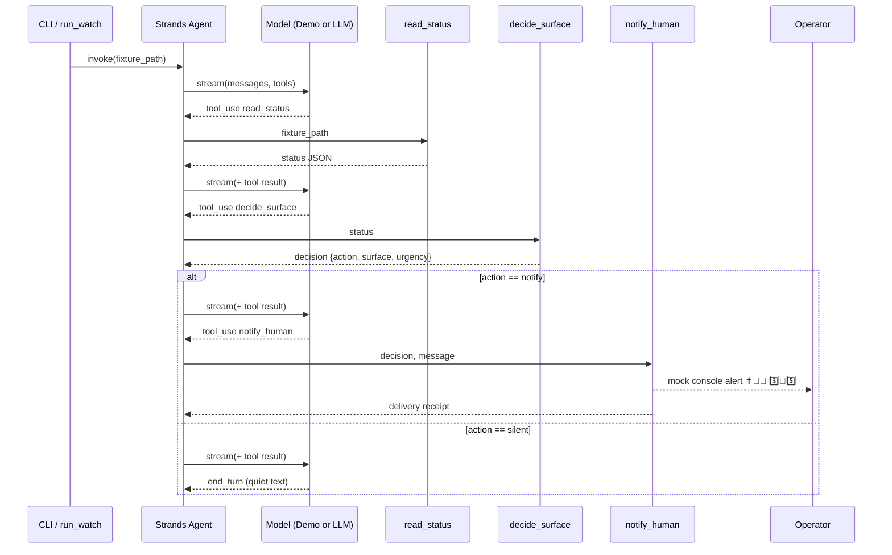

# Architecture — Morning Light Desk Sentinel

Morning Light Desk Sentinel is a **Strands Agents SDK** application that runs a real agent event loop over three domain tools. It reads mock desk fixtures, decides whether a human decision surface exists, and delivers a mock notification only when warranted.

## Design principles

1. **Quiet by default** — SAFE HOLD dry states produce no alert.
2. **Decision-grade only** — CLEAR go/no-go, SHORT stance, and real faults surface to the operator.
3. **Mock-first MVP** — fixtures and console notifications; no live trading or messaging keys.
4. **Real Strands loop** — `Agent` + `@tool` functions + model `stream()` events (demo or cloud).

## Component diagram

## Agent loop sequence

## Tool responsibilities

### `read_status(fixture_path)`

- Loads JSON from `fixtures/` (or an explicit path).
- Returns structured desk state: phase, health, market regime, dry_run flag, signals.
- **No network I/O** — pure file read for hackathon demo.

### `decide_surface(status)`

Deterministic policy engine (tool, not prompt magic):

| Input signal | `action` | `surface` | `urgency` |
| --- | --- | --- | --- |
| `health == FAULT` | notify | fault | critical |
| `phase == CLEAR` and `ready` | notify | go_no_go | high |
| `market_regime == SHORT` | notify | go_no_go | medium |
| `phase == SAFE_HOLD` and dry | silent | — | none |
| otherwise | silent | — | none |

### `notify_human(decision, message)`

- Prints a formatted banner to stdout (mock channel).
- Includes owner ✝️🧿🪬 and assistant 3️⃣🧿5️⃣ signs.
- Returns a JSON delivery receipt for the agent transcript.

## Model modes

| `DESK_MODEL_MODE` | Behavior |
| --- | --- |
| `demo` (default) | `DemoModel` walks the tool chain deterministically — no API keys |
| `openai` | Live LLM via `OpenAIModel` |
| `bedrock` | Live LLM via `BedrockModel` |

Demo mode still executes the **full Strands event loop** (tool registration, streaming, tool results, multi-turn). This satisfies local hackathon review without cloud setup.

## Extension path (post-MVP)

- Swap fixture reader for scheduled polling of a dry-run status API
- Replace `notify_human` mock channel with SNS, Slack, or Telegram (with secrets in env)
- Deploy agent to **Amazon Bedrock AgentCore** using Strands deployment guides
- Add session memory for operator GO/NO-GO replies

## File map

| Path | Role |
| --- | --- |
| `desk_sentinel/agent.py` | Agent factory, system prompt, `run_watch()` |
| `desk_sentinel/demo_model.py` | Keyless scripted model provider |
| `desk_sentinel/tools/*.py` | Domain tools |
| `desk_sentinel/__main__.py` | CLI: `python3 -m desk_sentinel demo` |
| `fixtures/*.json` | Mock desk scenarios |
